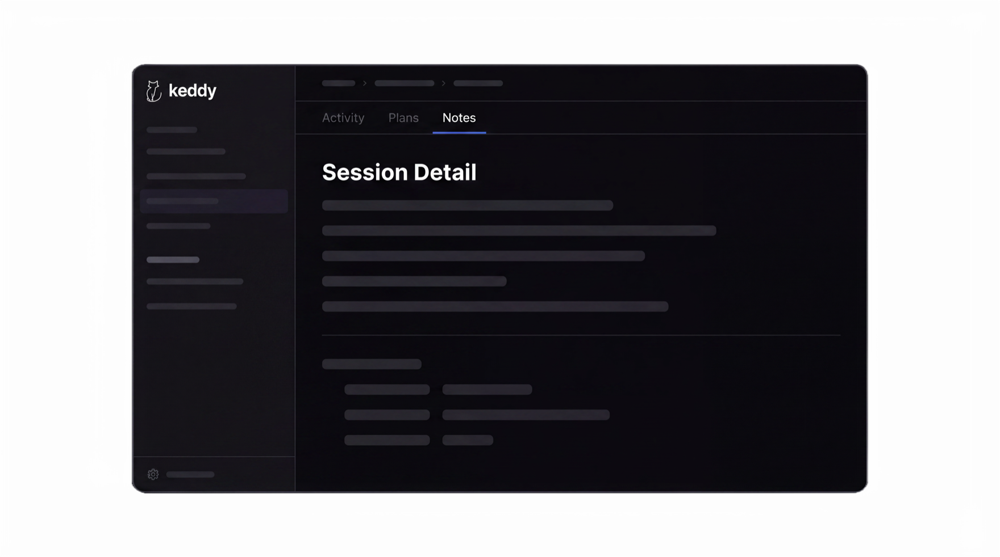
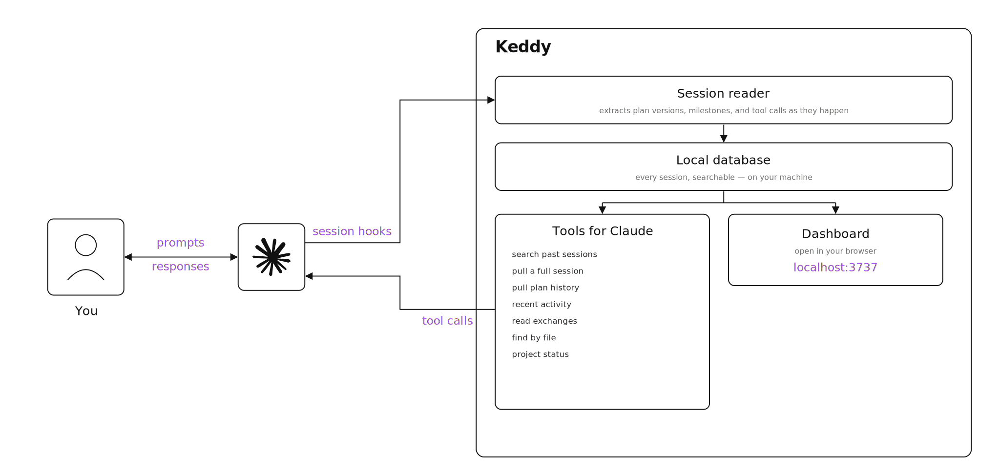

<p align="center">
  <picture>
    <source media="(prefers-color-scheme: dark)" srcset="docs/assets/wordmark-dark.svg">
    
  </picture>
</p>

<h3 align="center">Session intelligence for agentic development.</h3>

<p align="center">
  Recall any past session in seconds. Stop losing hours digging through raw JSONL.
</p>

<p align="center">
  <a href="https://www.npmjs.com/package/keddy"></a>
  <a href="https://github.com/emireaksay-8867/keddy/actions/workflows/ci.yml"></a>
  <a href="LICENSE"></a>
  <a href="https://www.npmjs.com/package/keddy"></a>
  
</p>

<p align="center">
  
</p>

---

Every agentic session leaves a JSONL trail — plans iterated, files touched, paths tried. You *can* dig through it. It costs hours, burns tokens, and the answer usually isn't right. Keddy captures every session automatically and turns it into an index you and your agent can actually use.

Keddy runs locally. It captures every Claude Code session through hooks, parses the transcripts as they happen, and stores everything in a local database. From there you get two ways to reach back in: **MCP tools your agent can call** (so Claude pulls past context on demand) and a **local dashboard** (so you navigate timelines, plans, and milestones in your browser). No data leaves your machine.

## Quick start

```bash
npm install -g keddy
keddy init
keddy open
```

Or run once without installing: `npx keddy init`

`keddy init` installs four Claude Code hooks, creates a local database at `~/.keddy/keddy.db`, and registers the MCP server. Every session you run in Claude Code from that point forward is captured automatically.

## How it works

<picture>
  <source media="(prefers-color-scheme: dark)" srcset="docs/assets/architecture-dark.svg">
  
</picture>

Four Claude Code hooks feed a local session reader that parses the transcript and writes to a SQLite database on your machine. The database serves two surfaces: MCP tools Claude can call to pull context, and a dashboard you open in your browser to review sessions visually.

| Hook | Timing | What it captures |
|---|---|---|
| `SessionStart` | Sync, fires when a session begins | Session record + returns past context for the project if any |
| `Stop` | Async, fires after each turn | Latest exchange, tool calls, token counts, segment classification |
| `PostCompact` | Async, fires when Claude compacts context | Compaction event with exchange deltas and optional summary |
| `SessionEnd` | Async, fires when the session ends | Full transcript parse, plan versions, milestones, optional AI analysis |

See [`docs/ARCHITECTURE.md`](docs/ARCHITECTURE.md) for the deeper technical breakdown.

## The dashboard

`keddy open` launches a local dashboard at `http://localhost:3737`. It serves a read-only view of everything Keddy has captured.

- **Sessions list** — every session across every project, with live search and filter by project
- **Session detail** — three tabs: Activity (timeline of exchanges with segments, plans, milestones), Plans (full plan version history with approval/rejection feedback), Notes (AI-generated retrospective if enabled)
- **Daily notes** — per-day synthesis of everything you worked on, bridging sessions
- **Full-text search** — across all prompts and responses, powered by SQLite FTS5
- **Live polling** — active sessions update in real time while you watch

The dashboard is a React SPA served by a Hono API. It reads from the same `~/.keddy/keddy.db` that the capture pipeline writes to.

## MCP tools

Keddy registers itself as an MCP server during `keddy init`, giving Claude seven tools it can call to pull context from your past sessions.

| Tool | What it does |
|---|---|
| `keddy_search_sessions` | Full-text search across every session's prompts and responses. Filter by project, days, or result limit. |
| `keddy_get_session` | Pull a full session — every exchange, plan version, milestone, and tool call. Returns large payloads (up to ~100KB). |
| `keddy_get_plans` | Pull plan version history with status, feedback, and exchange ranges. |
| `keddy_recent_activity` | Cross-project summary of the last N days — sessions, tokens, errors, files. |
| `keddy_get_transcript` | Read specific exchanges in full, both prompts and Claude's responses. Scope with `from`/`to` exchange indices. |
| `keddy_search_by_file` | Find every session that touched a given file path. |
| `keddy_project_status` | Current state of a project — active plan, pending tasks, recent milestones, top files. |

Example prompts that would trigger these tools:

> "What did I try last week on the auth refactor?" → `keddy_search_sessions`
> "Show me the history of `src/auth.ts` across my sessions." → `keddy_search_by_file`
> "What's the current state of this project before I start?" → `keddy_project_status`

<details>
<summary><b>Agent-mode tools (advanced)</b></summary>

<br>

Four additional tools become available when `agentTools: true` is set in config. These return smaller payloads optimized for programmatic use by sub-agents:

| Tool | What it does |
|---|---|
| `keddy_get_session_skeleton` | 3–5KB session outline: events, tasks, error counts, top files — before deep diving |
| `keddy_transcript_summary` | 5–8KB conversation outline: first line of each prompt with tool counts |
| `keddy_get_session_note` | Retrieve the latest AI-generated session note for a session, if one exists |
| `keddy_get_daily_note` | Retrieve the daily synthesis note for a given date |

</details>

## Session notes and daily notes

When you enable AI analysis, Keddy can automatically generate two kinds of notes.

**Session notes** are per-session retrospectives. When a session ends, Keddy launches an agent with access to the session's data through MCP. The agent produces a written summary of what actually happened — not just what was discussed — and a mermaid diagram of the session's flow. Short sessions (≤3 exchanges) use a direct Haiku call; longer sessions use the Agent SDK with Sonnet.

**Daily notes** synthesize every session from a given day into a single narrative. They bridge work across sessions so you can tell someone (or yourself, tomorrow) what you actually shipped.

Both are opt-in and off by default. See *Optional AI analysis* below for setup.

## Optional AI analysis

Keddy is designed to be useful without any AI. Every core feature — capture, search, segment detection, plan tracking, milestone extraction — runs programmatically on your machine with zero API calls.

AI analysis is an opt-in layer on top. Enable it only if you want session notes, daily notes, or AI-generated titles. You bring your own API key.

```bash
keddy config set analysis.enabled true
keddy config set analysis.apiKey sk-ant-...
```

| Feature | Default model | What it produces |
|---|---|---|
| Session notes | Claude Sonnet | Per-session retrospective + mermaid diagram |
| Daily notes | Claude Sonnet | Per-day synthesis across sessions |
| Session titles | Claude Haiku | Descriptive session titles |
| Segment summaries | Claude Haiku | Short summaries of each activity segment |
| Decision extraction | Claude Haiku | Key technical decisions surfaced from exchanges |

Supported providers: Anthropic (direct) and any OpenAI-compatible endpoint (set `analysis.baseUrl`). Each feature can be toggled and its model overridden independently.

## What Keddy indexes

Every session is parsed into structured data automatically — no AI required for any of this.

| Indexed | How |
|---|---|
| **Every exchange** — prompts, responses, tool calls, errors, tokens, timing | Parsed from JSONL via the four Claude Code hooks |
| **Every plan version** — full text, approval status, rejection feedback, version history | `EnterPlanMode` / `ExitPlanMode` tool detection |
| **Every milestone** — commits, pushes, pull requests, branches, test runs | Regex over bash tool inputs and outputs |
| **Every segment** — planning / implementing / testing / debugging / exploring / discussion / pivot / deploying | Classifier over tool-usage patterns per exchange |
| **Every compaction event** — before/after exchange counts, optional summary | `PostCompact` hook |
| **Full-text search** | SQLite FTS5 virtual table auto-synced via triggers |

## CLI reference

| Command | Description |
|---|---|
| `keddy init` | First-time setup: install hooks, create DB, register MCP server |
| `keddy open` | Launch dashboard and open in browser (port 3737) |
| `keddy status` | Show hook status, session count, database size |
| `keddy config [get\|set] [key] [value]` | Read or write configuration keys |
| `keddy import [--force]` | Import historical sessions from `~/.claude/projects/*.jsonl` |
| `keddy reimport` | Force re-import of every session (refresh all data) |
| `keddy backfill` | Migrate old exchanges to latest schema (content blocks) |
| `keddy version` | Print the installed version |
| `keddy help` | Print usage |

Examples:

```bash
# Enable AI analysis with your Anthropic key
keddy config set analysis.enabled true
keddy config set analysis.apiKey sk-ant-...

# Check what got imported
keddy status

# Pull in historical sessions after install
keddy import
```

## Configuration

Configuration lives at `~/.keddy/config.json` and is managed through `keddy config`. The file is created on first `keddy init`.

<details>
<summary><b>Full configuration reference</b></summary>

<br>

```jsonc
{
  "dbPath": "~/.keddy/keddy.db",           // Override the database location

  "analysis": {
    "enabled": false,                       // Master switch for all AI features
    "provider": "anthropic",                // "anthropic" or "openai-compatible"
    "apiKey": "",                           // Your API key — never committed, never sent anywhere but the provider
    "baseUrl": "",                          // Optional override for OpenAI-compatible endpoints

    "features": {
      "sessionTitles": {
        "enabled": true,
        "model": "claude-haiku-4-5-20251001"
      },
      "segmentSummaries": {
        "enabled": true,
        "model": "claude-haiku-4-5-20251001"
      },
      "decisionExtraction": {
        "enabled": true,
        "model": "claude-haiku-4-5-20251001"
      }
    }
  },

  "notes": {
    "sessionModel": "claude-sonnet-4-6",    // Model for session notes
    "dailyModel": "claude-sonnet-4-6",      // Model for daily notes
    "autoSessionNotes": false,              // Auto-generate on session end
    "autoDailyNotes": false                 // Auto-generate at end of day
  }
}
```

Settings can be changed at runtime through the dashboard's Settings page, or with `keddy config set <key> <value>`.

</details>

## Privacy and data handling

- **Everything runs locally.** The capture pipeline, database, dashboard, and MCP server all run on your machine. No data ever leaves unless you explicitly enable AI analysis and bring your own API key.
- **Your database lives at `~/.keddy/keddy.db`.** It's a plain SQLite file — you can inspect it, back it up, or delete it at any time.
- **No telemetry.** Keddy does not phone home, does not collect usage data, and does not include analytics.
- **AI analysis is opt-in and uses your own keys.** When enabled, prompts and transcripts are sent to the provider you choose (Anthropic by default). The key is stored in `~/.keddy/config.json` and is only used for the configured features.

## System requirements

- **Node.js 22.x** — Node 24 is not yet supported; stick to Node 22 until the native module mismatch is resolved
- **macOS and Linux** — Tested on macOS 14+ and recent Ubuntu. Windows support is untested
- **Claude Code 1.0+** — Keddy uses the Claude Code hooks API and the MCP stdio transport
- **SQLite via better-sqlite3** — Installed automatically; requires a C++ toolchain on first install

## Upgrade

```bash
npm install -g keddy@latest
```

Schema migrations run automatically on first launch after an upgrade. You don't need to re-run `keddy init` unless the hook format changes (which will be called out in release notes).

## Uninstall

```bash
# Remove Claude Code hooks, MCP registration, and installed binary
npm uninstall -g keddy

# Delete your Keddy data (optional — you may want to keep this for a re-install)
rm -rf ~/.keddy
```

If hooks linger in `~/.claude/settings.json`, remove entries whose `command` contains `keddy` manually.

## Troubleshooting

<details>
<summary><b>Hooks aren't firing</b></summary>

Check `~/.claude/settings.json` — you should see four hook entries (`SessionStart`, `Stop`, `PostCompact`, `SessionEnd`) with `command` paths pointing to Keddy's handler. Re-run `keddy init` if any are missing.

Confirm with `keddy status` — it reports which hooks are currently registered.

</details>

<details>
<summary><b>Dashboard won't open / port 3737 is in use</b></summary>

Something else is bound to port 3737. Kill the other process or configure Keddy to use a different port (coming in a future release — track in GitHub issues).

</details>

<details>
<summary><b>Native module mismatch after Node upgrade</b></summary>

`better-sqlite3` and other native dependencies are compiled against a specific Node version. If you upgrade Node (especially to an unsupported version like 24), the binary breaks.

Fix:

```bash
npm uninstall -g keddy
# Switch back to Node 22
npm install -g keddy
```

</details>

<details>
<summary><b>Database is locked / WAL issues</b></summary>

Keddy uses SQLite's WAL mode for concurrent reads and writes. If a process crashed mid-write, you may see `.keddy.db-wal` and `.keddy.db-shm` files alongside the main database. They're safe to leave — SQLite will recover on next open.

If the database is genuinely stuck, close `keddy open` and any running Claude Code sessions, then reopen.

</details>

<details>
<summary><b>Imported sessions are missing</b></summary>

`keddy import` scans `~/.claude/projects/**/*.jsonl`. If your Claude Code data lives elsewhere, imports won't find it. Check where Claude Code writes its transcripts on your system.

To force a complete re-import: `keddy reimport`.

</details>

## Tech stack

| Layer | Technology |
|---|---|
| Runtime | Node.js 22.x |
| Language | TypeScript (strict mode) |
| Database | SQLite via `better-sqlite3` (WAL mode, FTS5) |
| CLI build | `tsup` |
| API server | Hono |
| Frontend | React 19, Tailwind CSS v4, Vite |
| MCP | `@modelcontextprotocol/sdk` |
| Tests | `vitest` |

## Development

```bash
git clone https://github.com/emireaksay-8867/keddy.git
cd keddy
npm install

npm test              # Run the test suite
npm run typecheck     # TypeScript strict check
npm run build         # Build CLI + dashboard bundles
npm run dev           # Watch mode for CLI + dashboard + server
```

See [`CONTRIBUTING.md`](CONTRIBUTING.md) for the full development workflow, PR process, and coding standards.

## Architecture and decisions

- [`docs/ARCHITECTURE.md`](docs/ARCHITECTURE.md) — how the capture pipeline, database, MCP server, and dashboard fit together
- [`docs/DECISIONS.md`](docs/DECISIONS.md) — why Keddy is session intelligence, not a memory layer; why programmatic detection over LLM classification; why local-first

## Contributing

Issues and pull requests are welcome. Start with [`CONTRIBUTING.md`](CONTRIBUTING.md), then browse the open issues — anything tagged `good first issue` is a good starting point.

## Security

Report vulnerabilities privately per [`SECURITY.md`](SECURITY.md). Do not open public issues for security problems.

## Acknowledgments

Built on:

- [Claude Code](https://docs.claude.com/en/docs/claude-code/overview) — the hooks API makes this tool possible
- [`@modelcontextprotocol/sdk`](https://github.com/modelcontextprotocol/typescript-sdk) — MCP server plumbing
- [`better-sqlite3`](https://github.com/WiseLibs/better-sqlite3) — synchronous SQLite with FTS5
- [Hono](https://hono.dev) — lightweight API server
- [Vite](https://vitejs.dev) and [Tailwind CSS](https://tailwindcss.com) — dashboard tooling

## License

[Apache-2.0](LICENSE) — Emir Enes Aksay
